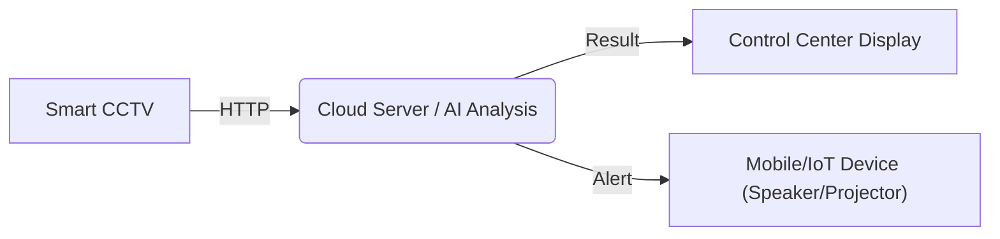
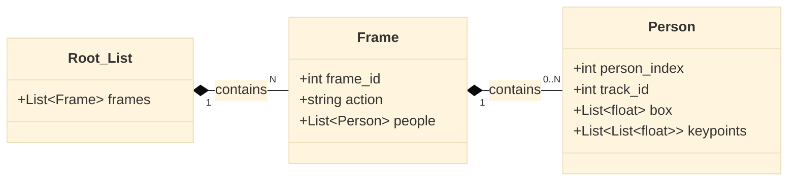

# 🛡️ Safety Street: 길거리 이상행동 분류 서비스 (Abnormal Behavior Detection)


> **"안전을 위한 골든타임 확보"** — CCTV와 AI를 활용한 실시간 이상행동 감지 및 조기 경보 시스템

    

👥 Team EXTREME LAB

Team Leader: Hong Seong-min (Roni81) 

Role: Project Management, AI Modeling, Algorithm Design, System Architecture

#### pdf_Linke https://drive.google.com/file/d/1r0klkeny-HAVczeBlgfi-oxEBZAFTFLT/view?usp=sharing

## 📖 Project Overview (프로젝트 개요)
[cite_start]최근 급증하는 '묻지마 범죄'와 '급성 심정지' 사고 등 길거리 안전 문제에 대응하기 위한 AI 시스템입니다. [cite: 18, 22]
기존의 단순 CCTV 모니터링을 넘어, **YOLO Pose**를 통한 관절 추적과 **ST-GCN(시공간 그래프 합성곱 신경망)** 알고리즘을 결합하여 사람의 행동을 정밀하게 분석합니다.

### 🎯 Core Objectives
* [cite_start]**골든타임 확보:** 심정지(실신) 등 응급 상황 발생 시 즉각적인 119 신고 및 주변 알림 [cite: 18]
* [cite_start]**범죄 예방:** 폭행, 기물파손 등 범죄 징후 포착 시 경고 방송 및 112 자동 신고 [cite: 153]
* [cite_start]**사생활 보호:** 객체 감지 시 얼굴 블러(Blur) 처리를 통한 개인정보 보호 [cite: 148]

---

## 🛠 System Architecture (시스템 구조)
[cite_start]스마트 CCTV에서 수집된 영상은 클라우드 서버(AI 분석)를 거쳐 관제실 디스플레이와 현장 알림 기기로 연결됩니다. [cite: 158]


## Key Algorithms (핵심 알고리즘)본 프로젝트는 단순한 이미지 분류가 아닌, **관절의 좌표 변화량(Vector)**을 분석하여 행동을 정의했습니다.
#### 1. 👊 Assault (폭행) - "말단 부위의 폭발적 가속"
* 원리: 손목(Wrist)이나 발목(Ankle)이 0.1초 내에 평소 걷기 속도 대비 5배 이상 이동했는지 계산
* 수식: $\sqrt{(x_{t}-x_{t-1})^{2}+(y_{t}-y_{t-1})^{2}} > Threshold$ 
#### 2. 😵 Swoon (실신) - "종횡비 역전 및 수직 낙하"
* 원리: 서 있을 때(Height > Width)와 달리 쓰러지면 너비가 더 길어지는 Aspect Ratio Inversion 현상 감지
* 수식: $Y_{current} - Y_{past} > 0.15 \times Height$ (급격한 코 좌표 하강)
#### 3. 🥴 Drunken (주취) - "불규칙한 무게중심(Sway)"
* 원리: 골반(Hip) 중심축이 흔들리고, 머리가 몸통보다 더 크게 흔들리는 패턴 분석 
* 수식: $Score_{drunk} = w_{1} \cdot Std(x_{hip}) + w_{2} \cdot Std(x_{head})$
#### 4. 🔨 Vandalism (기물파손) - "고정된 몸통 + 과도한 사지 움직임"
* 원리: 몸통은 고정된 상태($Velocity_{hip} \approx 0$)에서 팔다리만 과도하게 움직이는 비율 계산
* 수식: $\frac{Velocity_{limb}}{Velocity_{hip}} > 4.0$ 10

📊 Performance & Benchmark (성능 및 검증)
Why ST-GCN?
기존 LSTM 방식보다 ST-GCN이 복잡한 행동 패턴 인식에 있어 월등한 성능을 보였습니다. 


Benchmark: NTU-RGB+D 데이터셋 기준 정확도 81.5% (LSTM 대비 약 8~10% 향상) 


Training Result
자체 구축한 데이터셋(약 3,489개 영상, 1.04TB)을 전처리하여 학습을 진행했습니다. 


Max Train Accuracy: 83.9% (Epoch 94) 


Max Val Accuracy: 79.4% (Epoch 86) 

💻 Tech Stack (기술 스택)

### Core AI & Deep Learning
- **Model:** YOLO11-Pose
- **Algorithm:** ST-GCN (Spatial Temporal Graph Convolutional Networks), LSTM
- **Framework:** PyTorch, Ultralytics

### Robotics & Environment
- **OS:** Ubuntu 22.04 LTS (Desktop), macOS (Apple Silicon M3 Dev Env)


### Tools
- **Language:** Python
- **Version Control:** Git, GitHub
- **Collaboration:** Jira, Confluence

## 📂 Project Structure (폴더 구조)

```bash
.
├── checkpoints/       # 학습 중간 저장된 모델 체크포인트
├── contents/          # 프로젝트 관련 자료 및 리소스
├── datasets/          # (Git LFS) 학습용 데이터셋 (.pkl)
├── src/
│   ├── data_preprocess/      # 데이터 전처리 및 정규화
│   │   ├── body_scale_normalization.py # 신체 비율 정규화
│   │   ├── generate_datasets.py        # 학습용 데이터셋 생성
│   │   └── preprocess_SC_GCN.py        # GCN 입력용 전처리
│   │
│   ├── detecting_realtime/   # 실시간 감지 모듈
│   │   └── inference_gui.py            # 추론 실행 스크립트
│   │
│   ├── GUI/                  # PyQt5 기반 어플리케이션 UI
│   │   ├── gui_pyqt.py                 # 메인 GUI 실행 코드
│   │   └── model.py                    # GUI 연동 모델 정의
│   │
│   ├── json_extract/         # 영상에서 Keypoints 추출
│   │   ├── extract_keypoints.py        # YOLO Pose 추론 및 좌표 추출
│   │   └── varify_json_data.py         # 추출된 JSON 데이터 검증
│   │
│   ├── model_train/          # ST-GCN 모델 학습
│   │   ├── train_ST_GCN.py             # 학습 메인 스크립트
│   │   └── model_check.py              # 모델 구조 확인
│   │
│   └── visualize/            # 시각화 및 로그 분석
│       ├── plot_keypoints.py           # 관절 좌표 시각화
│       ├── visualize_log.py            # 학습 로그 그래프화
│       └── training_log.csv            # 학습 기록 (Loss/Acc)
│
├── yolo11s-pose.pt    # YOLOv11 Small Pose 가중치
├── yolov8s-pose.pt    # YOLOv8 Small Pose 가중치
└── .gitignore

```

## 📀 Data for training Flow


## 🗼JSON schema


## 𝌭 알고리즘 비교
| 모델 구분 | 모델명 (발표년도) | Cross-Subject (CS) | Cross-View (CV) | 비고 |
| :--- | :--- | :--- | :--- | :--- |
| **Baseline** | Handcrafted + LSTM (2016) | 60.20% | 65.20% | 좌표를 단순 수치로 사용 |
| **LSTM (SOTA)** | STA-LSTM (2017) | 73.40% | 81.20% | LSTM에 Attention 기법 추가 |
| **LSTM (SOTA)** | GCA-LSTM (2017) | 74.40% | 82.80% | - |
| **GCN (전환점)** | **ST-GCN (2018)** | **81.50%** | **88.30%** | **LSTM 대비 약 8~10% 성능 향상** |


* Arxiv link : https://arxiv.org/pdf/1801.07455

## 📉training process plot


